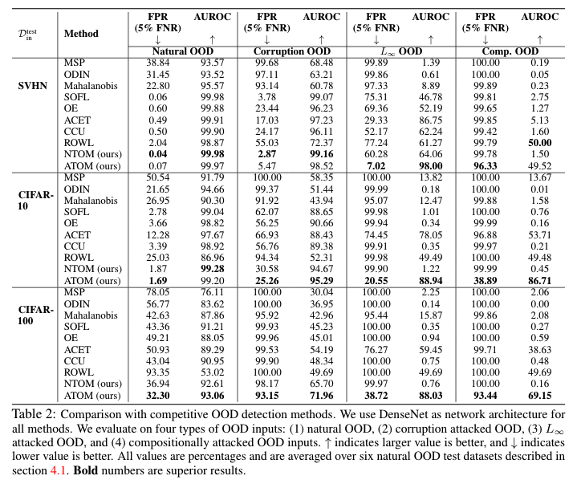

# Robust Out-of-distribution Detection via Informative Outlier Mining
This project is for the paper: Robust Out-of-distribution Detection via Informative Outlier Mining. Some codes are from [ODIN](https://github.com/facebookresearch/odin), [Outlier Exposure](https://github.com/hendrycks/outlier-exposure), [Deep Mahalanobis Detector](https://github.com/pokaxpoka/deep_Mahalanobis_detector), [Corruption and Perturbation Robustness](https://github.com/hendrycks/robustness) and [Certified Certain Uncertainty](https://github.com/AlexMeinke/certified-certain-uncertainty).

## Experimental Results


## Preliminaries
It is tested under Ubuntu Linux 16.04.1 and Python 3.6 environment, and requries some packages to be installed:
* [PyTorch](https://pytorch.org/)
* [scipy](https://github.com/scipy/scipy)
* [numpy](http://www.numpy.org/)
* [sklearn](https://scikit-learn.org/stable/)

## Downloading In-distribution Dataset
* [SVHN](http://ufldl.stanford.edu/housenumbers/): need to download Format 2 data. 
* [CIFAR](https://www.cs.toronto.edu/~kriz/cifar.html): included in PyTorch.

## Downloading Auxiliary Unlabeled Dataset

To download **80 Million Tiny Images** dataset. In the **root** directory, run
```
cd datasets/unlabeled_datasets/80M_Tiny_Images
wget http://horatio.cs.nyu.edu/mit/tiny/data/tiny_images.bin
```

## Downloading Out-of-distribution Test Datasets

We provide links and instructions to download each dataset:

* [SVHN](http://ufldl.stanford.edu/housenumbers/test_32x32.mat): download it and place it in the folder of `datasets/ood_datasets/svhn`. Then run `python select_svhn_data.py` to generate test subset.
* [Textures](https://www.robots.ox.ac.uk/~vgg/data/dtd/download/dtd-r1.0.1.tar.gz): download it and place it in the folder of `datasets/ood_datasets/dtd`.
* [Places365](http://data.csail.mit.edu/places/places365/test_256.tar): download it and place it in the folder of `datasets/ood_datasets/places365/test_subset`. We randomly sample 10,000 images from the original test dataset. We provide the file names for the images that we sample in `datasets/ood_datasets/places365/test_subset/places365_test_list.txt`.
* [LSUN-C](https://www.dropbox.com/s/fhtsw1m3qxlwj6h/LSUN.tar.gz): download it and place it in the folder of `datasets/ood_datasets/LSUN`.
* [LSUN-R](https://www.dropbox.com/s/moqh2wh8696c3yl/LSUN_resize.tar.gz): download it and place it in the folder of `datasets/ood_datasets/LSUN_resize`.
* [iSUN](https://www.dropbox.com/s/ssz7qxfqae0cca5/iSUN.tar.gz): download it and place it in the folder of `datasets/ood_datasets/iSUN`.

For example, run the following commands in the **root** directory to download **LSUN-C**:
```
cd datasets/ood_datasets
wget https://www.dropbox.com/s/fhtsw1m3qxlwj6h/LSUN.tar.gz
tar -xvzf LSUN.tar.gz
```

## Downloading Pre-trained Models

We provide pre-trained DenseNet models for normal, SOFL, OE, ACET, CCU, ROWL, NTOM, and ATOM methods on SVHN, CIFAR-10, and CIFAR-100 datasets. They can be downloaded from [Google Drive](https://drive.google.com/drive/folders/1RdeO5zdmIZY5aExlV7q1jfzDTFgU1Xrr?usp=sharing). 

## Overview of the Code
### Running Experiments
* `select_svhn_data.py`: select SVHN test data.
* `eval_ood_detection.py`: evaluate OOD detection performance of models.
* `compute_metrics.py`: compute metrics of evaluation results.
* `gen_rowl_train_data.py`: generate ROWL training data.
* `gen_validation_data.py`: generate validation data used to select the best q.
* `train_acet.py`: train ACET model.
* `train_atom.py`: train ATOM model.
* `train_ccu.py`: train CCU model.
* `train_oe.py`: train OE model.
* `train_rowl.py`: train ROWL model.
* `train_sofl.py`: train SOFL model.
* `train.py`: train normal model.
* `tune_mahalanobis_hyperparams.py`: tune hyperparameters of Mahalanobis detector.
* `tune_odin_hyperparams.py`: tune hyperparameters of ODIN detector.

### Example
For CIFAR-10 experiments, you can run the following commands to get results.

* train an normal model:

`python train.py --name normal`

* train an SOFL model:

`python train_sofl.py --name SOFL`

* train an OE model:

`python train_oe.py --name OE`

* train an ACET model:

`python train_acet.py --name ACET`

* train an CCU model:

`python train_ccu.py --name CCU`

* train an ROWL model:

`python train_rowl.py --name ROWL`

* train an NTOM model:

`python train_ntom.py --name NTOM`

* train an ATOM model:

`python train_atom.py --name ATOM`

* Evaluate MSP:

`python eval_ood_detection.py --name normal --method msp`

`python eval_ood_detection.py --name normal --method msp --corrupt`

`python eval_ood_detection.py --name normal --method msp --adv`

`python eval_ood_detection.py --name normal --method msp --adv-corrupt`

* Evaluate ODIN:

`python eval_ood_detection.py --name normal --method odin`

`python eval_ood_detection.py --name normal --method odin --corrupt`

`python eval_ood_detection.py --name normal --method odin --adv`

`python eval_ood_detection.py --name normal --method odin --adv-corrupt`

* Evaluate Mahalanobis:

`python tune_mahalanobis_hyperparams.py --name normal`

`python eval_ood_detection.py --name normal --method mahalanobis`

`python eval_ood_detection.py --name normal --method mahalanobis --corrupt`

`python eval_ood_detection.py --name normal --method mahalanobis --adv`

`python eval_ood_detection.py --name normal --method mahalanobis --adv-corrupt`

* Evaluate SOFL:

`python eval_ood_detection.py --name SOFL --method sofl`

`python eval_ood_detection.py --name SOFL --method sofl --corrupt`

`python eval_ood_detection.py --name SOFL --method sofl --adv`

`python eval_ood_detection.py --name SOFL --method sofl --adv-corrupt`

* Evaluate OE:

`python eval_ood_detection.py --name OE --method msp`

`python eval_ood_detection.py --name OE --method msp --corrupt`

`python eval_ood_detection.py --name OE --method msp --adv`

`python eval_ood_detection.py --name OE --method msp --adv-corrupt`

* Evaluate ACET:

`python eval_ood_detection.py --name ACET --method msp`

`python eval_ood_detection.py --name ACET --method msp --corrupt`

`python eval_ood_detection.py --name ACET --method msp --adv`

`python eval_ood_detection.py --name ACET --method msp --adv-corrupt`

* Evaluate CCU:

`python eval_ood_detection.py --name CCU --method msp`

`python eval_ood_detection.py --name CCU --method msp --corrupt`

`python eval_ood_detection.py --name CCU --method msp --adv`

`python eval_ood_detection.py --name CCU --method msp --adv-corrupt`

* Evaluate ROWL:

`python eval_ood_detection.py --name ROWL --method rowl`

`python eval_ood_detection.py --name ROWL --method rowl --corrupt`

`python eval_ood_detection.py --name ROWL --method rowl --adv`

`python eval_ood_detection.py --name ROWL --method rowl --adv-corrupt`

* Evaluate NTOM:

`python eval_ood_detection.py --name NTOM --method ntom`

`python eval_ood_detection.py --name NTOM --method ntom --corrupt`

`python eval_ood_detection.py --name NTOM --method ntom --adv`

`python eval_ood_detection.py --name NTOM --method ntom --adv-corrupt`

* Evaluate ATOM:

`python eval_ood_detection.py --name ATOM --method atom`

`python eval_ood_detection.py --name ATOM --method atom --corrupt`

`python eval_ood_detection.py --name ATOM --method atom --adv`

`python eval_ood_detection.py --name ATOM --method atom --adv-corrupt`

* Compute metrics:

`python compute_metrics.py --name normal --method msp`

`python compute_metrics.py --name normal --method odin`

`python compute_metrics.py --name normal --method mahalanobis`

`python compute_metrics.py --name SOFL --method sofl`

`python compute_metrics.py --name OE --method msp`

`python compute_metrics.py --name ACET --method msp`

`python compute_metrics.py --name CCU --method msp`

`python compute_metrics.py --name ROWL --method rowl`

`python compute_metrics.py --name NTOM --method ntom`

`python compute_metrics.py --name ATOM --method atom`
